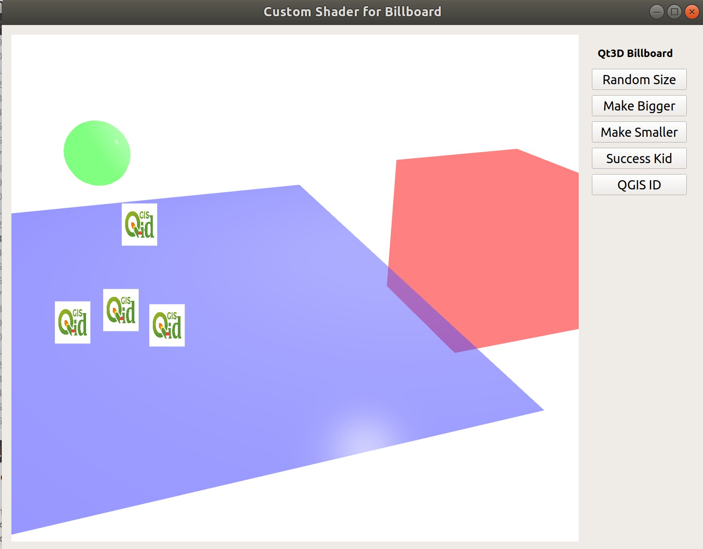

# qt3d-custom-shader
Learning Qt3D with Custom Shader.

## Billboards
https://github.com/wonder-sk/qt3d-experiments/tree/master/billboards is the QML version.  
https://github.com/ismailsunni/qt3d-custom-shader is the C++ version.  
This fork is the Python version. 

Below is a screenshot and an animated gif from the C++ Version:

